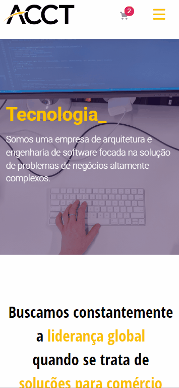

# Desafio Final Grupo 04 Hiring Coders - ACCT

O objetivo do desafio era desenvolver um projeto com o front-end com temática da empresa patrocinadora ACCT e com uso de API. O desafio propôs que o site tenha páginas de sobre e de produtos, e que na plataforma VTEX tenha uma página mostrando os leads cadastrados na API Gateway da AWS. 

Na página de sobre, deveria ter missão e valores da ACCT, bem como as virtudes dos serviços da ACCT.

A página de produtos deveria a lista de produtos cadastrados. Nós optamos por cadastrar os quatro produtos centrais da ACCT.

Também criamos uma página de contato para cadastrar os prospectos da empresa, com integração com a API Gateway da AWS e a API da VTEX IO para identificar os prospectos que se tornaram clientes através de uma compra e mostrá-los na lista de leads dentro da plataforma da VTEX.

  * [Demos](#demos)
    + [Home](#home)
      - [Home - Desktop](#home---desktop)
      - [Home - Mobile](#home---mobile)
    + [Sobre](#sobre)
      - [Sobre - Desktop](#sobre---desktop)
      - [Sobre - Mobile](#sobre---mobile)
    + [Produtos](#produtos)
      - [Produtos - Desktop](#produtos---desktop)
      - [Produtos - Mobile](#produtos---mobile)
    + [Contato](#contato)
      - [Contato - Desktop](#contato---desktop)
      - [Contato - Mobile](#contato---mobile)

## Demos

### Home

#### Home - Desktop

#### Home - Mobile

### Sobre

#### Sobre - Desktop

#### Sobre - Mobile

### Produtos

#### Produtos - Desktop

#### Produtos - Mobile

### Contato

#### Contato - Desktop

#### Contato - Mobile

